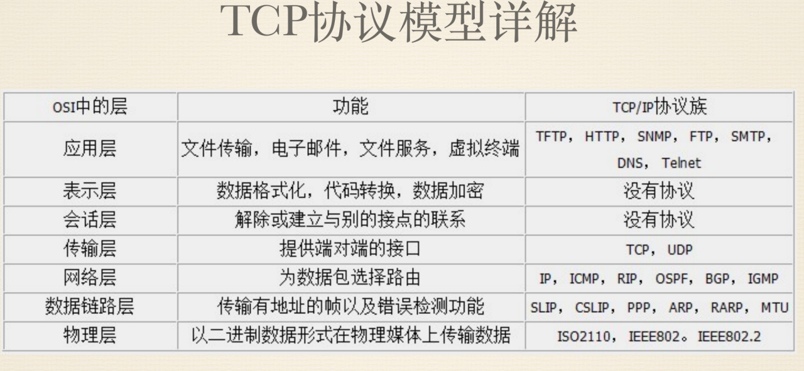
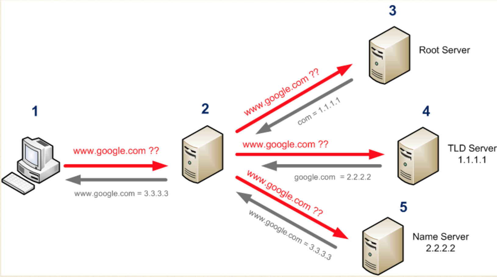
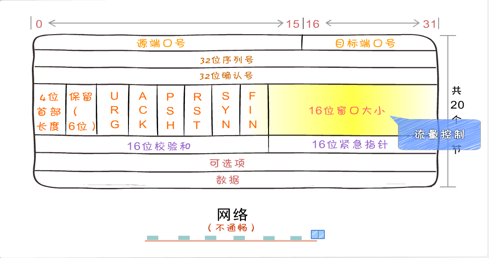
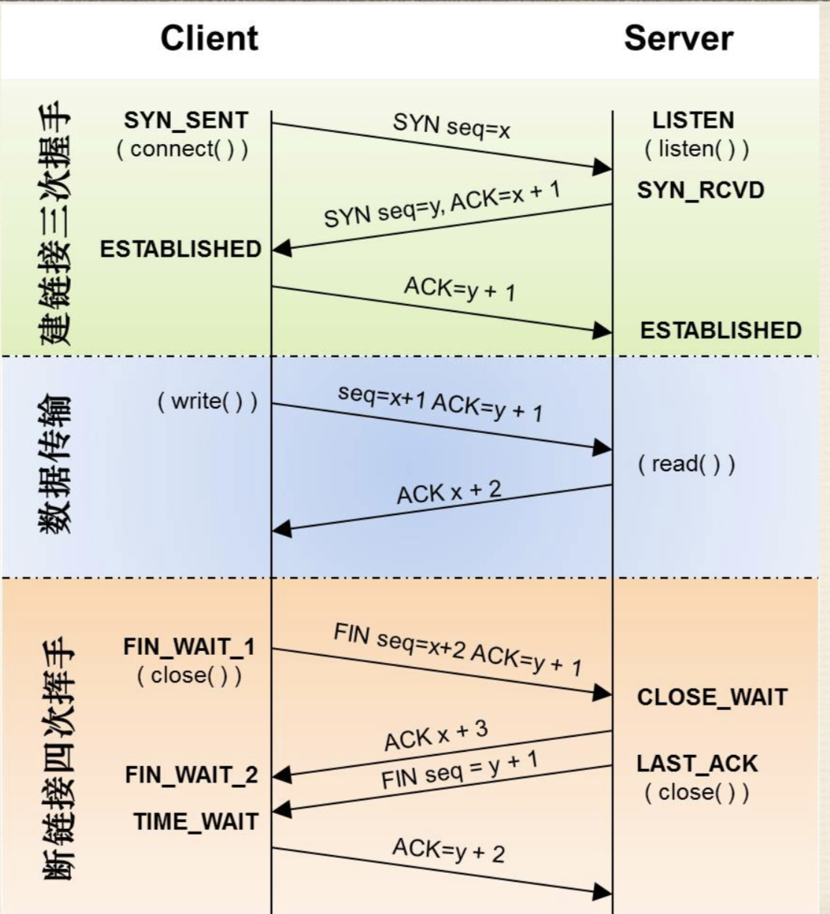
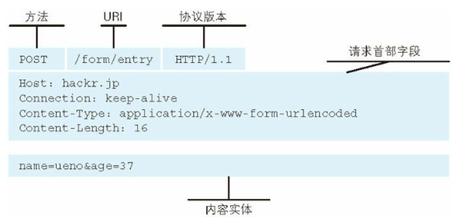
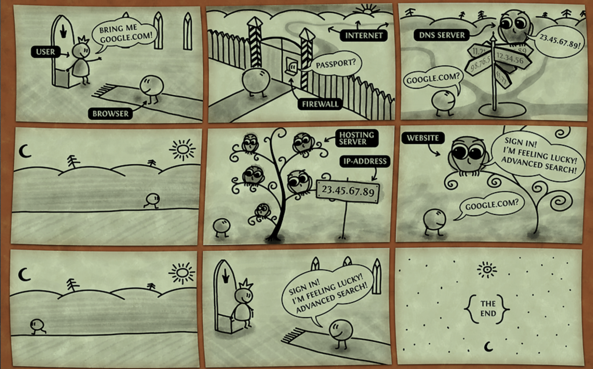
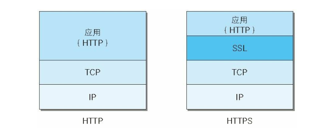
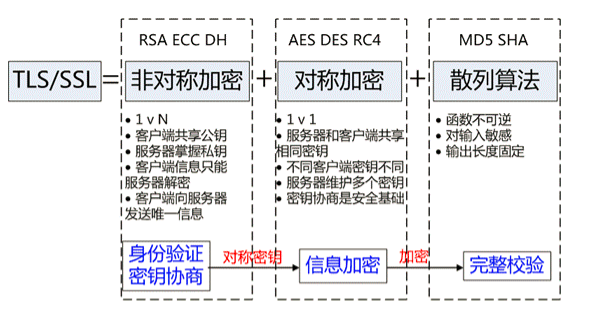
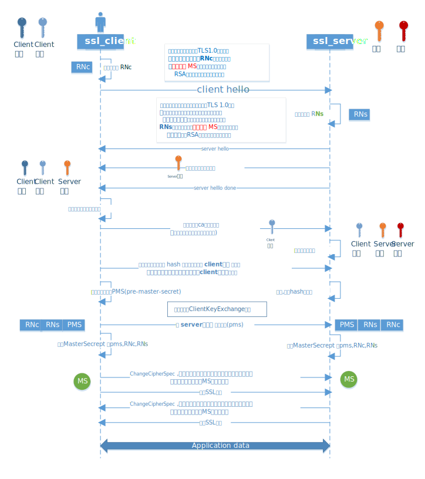

> 在革命事业中，认识到自己的缺点就等于改正了一大半。 - 列宁

参考文章：

- http://www.ruanyifeng.com/blog/2012/05/internet_protocol_suite_part_i.html
- http://www.ruanyifeng.com/blog/2012/06/internet_protocol_suite_part_ii.html
- https://github.com/freeWd/Crash-Course-Computer-Science-Chinese
- https://mp.weixin.qq.com/s?__biz=MzAxOTc0NzExNg==&mid=2665513094&idx=1&sn=a2accfc41107ac08d74ec3317995955e#rd

上一节的计算机基础，我们大致的了解了计算机的整体结构和简单的运算过程。计算机为计算而成，可能随着后期发展出现了更多的用途，通过编程编写不同用处的程序，但是在 70s 之前，几乎大部分的计算机都是单独运行的。

# 计算机网络的发展

- 早期通常在公司，研究室内部使用，为了方便信息交换和共享物理资源
- `局域网`， 简称 `LAN` 计算机近距离构成的小型网络
- 以太网 （是 LAN 技术最著名和成功的具体实现）

  - 最简单形式是：一条以太网电线连接数台计算机， 当一台计算机要传数据给另一台计算机时，它以`电信号形式`，将数据传入电缆。

  以太网的问题：因为电缆是共享的，其他连接的计算机也可以获取到此数据，

  解决方法：以太网需要每台计算机有唯一的媒体访问控制地址 简称 `MAC地址`， 这个唯一的地址放在头部，作为数据的前缀发送到网络中，所以，计算机只需要监听以太网电缆只有看到自己的 MAC 地址，才处理数据

- `载体(carrier)`指运输数据的共享媒介

  - 以太网的"载体"是铜线
  - WiFi 的"载体"是传播无线电波的空气
  - 载体传输数据的速度 叫`带宽`

  计算机共享载体的问题: 随着网络流量上升 两台计算机想同时写入数据的概率也会上升，就会产生冲突(就像两个人同时在电话里讲话)

  解决方法：停止传输，等待网络空闲, 然后再试一遍

  新问题：其他计算机也打算这样做，导致越来越多冲突

  新的解决方法：加入随机时间的概念，每个计算机冲突后重发的时间是不一致的，有的 1s，有的 1.3s，再有冲突，再生成随机时间，以此类推（退避）

除此之外，为了 "减少冲突+提升效率", 我们需要减少同一载体中设备的数量，

举例子：一根电缆连 6 台计算机，构成一个冲突域，为了减少冲突 我们可以用交换机把它拆成两个冲突域

- 交换机：交换机位于两个更小的网络之间，必要时才在两个网络间传数据，它会记录一个列表，写着哪个 MAC 地址在哪边网络，如果跨网络传播，两边网络都会暂时占用，否则不会影响另一边的使用

大的计算机网络也是这样构建的，包括最大的网络 - `互联网`, 也是多个连在一起的稍小一点网络,使不同网络间可以传递信息.

这些大型网络中，从一个地点到另一个地点通常有多条路线，如何选择路线呢？ 引出新的概念 --- `路由`

类似邮政系统，A 地 ---》 B 地 有多条线路，路由能根据当前线路的拥堵情况和传输距离，速度等综合考量，将信息选择一条合适的终止路径发送出去

# 互联网

你的计算机和一个巨大的分布式网络连在一起的网络就是`互联网`

- 以看在线视频为例：

  计算机为了获取这个视频，首先要连到局域网，也叫 LAN

  你家 WIFI 路由器连着的所有设备，组成了局域网.

  局域网再连到广域网，`广域网也叫 WAN`

  WAN 的路由器一般属于你的"互联网服务提供商"

  广域网里，先连到一个区域性路由器，这路由器可能覆盖一个街区

  然后连到一个更大的 WAN，可能覆盖整个城市

  可能再跳几次，但最终会到达互联网主干

  互联网主干由一群超大型、带宽超高路由器组成

  数据包（packet）要先到互联网主干,沿着主干到达有对应视频文件的服务器(比如 bilibili)

  数据包从你的计算机跳到 bilibili 服务器，可能要跳个 10 次 (比如：先跳 4 次到互联网主干，2 次穿过主干，主干出来可能再跳 4 次，然后到 bilibili 服务器)

  ```
  # 可以看出跳转的路径
  traceroute www.bilibili.com
  ```

  但报文到底是怎么过去的？

  首先：每台联网的计算机都需要一个 IP 地址

  这个地址分成两个部分 - 前一部分代表网络 - 后一部分代表主机。

  比如，IP 地址 172.16.254.1，这是一个 32 位的地址，假定它的网络部分是前 24 位（172.16.254），那么主机部分就是后 8 位（最后的那个 1）。处于同一个子网络的电脑，它们 IP 地址的网络部分必定是相同的，也就是说 172.16.254.2 应该与 172.16.254.1 处在同一个子网络。

  但是，问题在于单单从 IP 地址，我们无法判断网络部分。还是以 172.16.254.1 为例，它的网络部分，到底是前 24 位，还是前 16 位，甚至前 28 位，从 IP 地址上是看不出来的。

  那么，怎样才能从 IP 地址，判断两台计算机是否属于同一个子网络呢？ 这就要用到另一个参数`子网掩码”（subnet mask)`

  所谓“子网掩码”，就是表示子网络特征的一个参数。它在形式上等同于 IP 地址，也是一个 32 位二进制数字，它的网络部分全部为 1，主机部分全部为 0。比如，IP 地址 172.16.254.1，如果已知网络部分是前 24 位，主机部分是后 8 位，那么子网络掩码就是 11111111.11111111.11111111.00000000，写成十进制就是 255.255.255.0。

网络中传输数据是`报文交换`, 报文在互联网想要传输需要符合相关的协议。报文具体格式由"互联网协议"定义。

当报文比较大时会阻塞网络，为了解决这个问题：

将大报文分成很多小块，叫`数据包`， 每个数据包都有目标地址 因此路由器知道发到哪里。

但是产生了两个新问题：

- 数据包记录了地址，但是不知道将包交给哪个程序
- 数据包走的是不同的路线，可能达到的顺序是乱序的

如何解决这两个问题：在 IP 协议的基础上开发新协议

- 最简单最常见的叫"用户数据报协议"，简称 UDP，头部里面包含有端口信息用于确认具体的程序，但是 UDP 无法得知数据包是否到达，但有些程序不太在乎这块的问题，比如视频会议

- TCP 数据包有序号，序号使接收方可以把数据包排成正确顺序，即使到达时间不同，而且 TCP 会有握手和挥手策略，保证确认数据的到达。缺点是确认码的存在将数据包的量翻了一倍

# 技术流的内容：

## 五层（七层）网络协议

为啥要了解这个？

- 从宏观上了解整个的互联网模型，高屋建瓴
- 互联网的实现，分成好几层。每一层都有自己的功能，我们平时接触的都是最上面的一层，要想了解互联网整体的情况就要了解每一层


图中我们可以看到，我们可以把互联网自下而上分为 5 层（或者 7 层），其中 表示层，会话层，传输层可以统一的认为是传输层

- 物理层 （连接电脑，最底层，物理手段连接）

  - 载体：光线，光缆，无线电波
  - 作用：是负责传送 0 和 1 的电信号

- 数据链路层（单纯的 0 和 1 没有意义，设置标准，多少信号位算一组，每组有什么意义）

  - 确定 0 和 1 的分组方式
  - 以太网协议（一组信号分为标头（Head）和数据（Data））
  - MAC 地址（每块网卡出厂的时候，都有一个全世界独一无二的 MAC 地址）
  - 广播（一块网卡如何知道另一块网卡）
  - 交换机属于数据链路层

- 网络层（mac 地址只能在子网络中发送数据，但网络分组的出现，无法广播出去，必须找到一种方法，能够区分哪些 MAC 地址属于同一个子网络，哪些不是。如果是同一个子网络，就采用广播方式发送，否则就采用"路由"方式发送）

  - 作用：引进一套新的地址，使得我们能够区分不同的计算机是否属于同一个子网络。这套地址就叫做"网络地址"
  - IP 协议，子网掩码
  - IP 数据包（可以把 IP 数据包直接放进以太网数据包的"数据"部分， IP 数据包也分为"标头"和"数据"两个部分）
  - 路由器属于网络层

- 传输层 （有了 mac 和 ip 的情况下，任然无法知道是计算机中的哪个软件的通信）

  - 作用：就是建立"端口到端口"的通信 （端口）
  - Unix 系统就把主机+端口，叫做"套接字"（socket）
  - UDP 协议（也有标头和数据，统一放在 IP 数据包的“数据”部分）
  - TCP 协议

- 应用层（规定应用程序的数据格式）
  - eg: TCP 协议可以为各种各样的程序传递数据，比如 Email、WWW、FTP 等等。那么，必须有不同协议规定电子邮件、网页、FTP 数据的格式，这些应用程序协议就构成了"应用层"
  - HTTP, FTP， SMTP.. 都属于应用层

## DNS 详解

要记住那些 IP:PORT 是很难的, 就产生了`域名`的概念

- 互联网有个特殊的服务 专门将`域名系统将域名和IP对应`，- 域名系统 - DNS

- 外网只有备案过的网站做域名解析才不会被服务商限制访问



### 域名分级：

- 顶级域名：.com, .gov
- 二级域名：google.com (仅二级域名就有三千万个)
- 子域名：images.google.com

### 域名服务器分级：

- Root Server - 根服务器 - 全球只有十几台，中国有
- TLD Server - 管理顶级域名
- Name Server - 管理非顶级域名：二级域名，三级域名

### 域名获取流程

- PC 携带域名(www.google.com)访问 DNS 服务器询问 IP 地地址（DNS 服务器是运营商负责维护的，我们的计算机只需要设置对应的 DNS 服务器地址既可以实现域名的解析）
  - 如果缓存了地址，直接返回该地址
  - 如果 DNS 服务器没有此域名的缓存地址，就去询问 Root Server, Root Server 检查域名后缀，看此后缀归哪个 TLD 服务器维护，并返回 TLD 服务器的信息。com = 1.1.1.1
  - DNS 服务器接着向此 TLD 服务器继续询问，返回域名所在的顶级域名（google.com）归哪个服务器维护（Name Server）
  - DNS 服务器最后向此 Name 服务器询问，返回 www.google.com 对应的 IP
  - DNS 获取到内容后，先缓存，再返回给 PC（如果 IP 地址修改，就涉及到数据的同步和更新）

## TCP 的连接细节

前面说到，TCP 相当于 UDP 的优势就是能确认信息是否接受到，它是如何做的呢？

- TCP 是面向连接的（举例：打电话，双方打招呼 喂喂喂，确认连接稳定再传输）
- UDP 无连接（举例：局域网的广播，只管发送，不管是否接受到）

### TCP 数据包封装



对于 TCP 头部来说，有几个字段是比较重要的

- 源端口号和目标端口号，计算机通过端口号识别访问哪个服务,比如 http 服务或 ftp 服务，发送方端口号是进行随机端口，目标端口号决定了接收方哪个程序来接
- 32 位序列号[Sequence number]: TCP 用序列号对数据包进行标记，以便在到达目的地后重新重装，假设当前的序列号为 s，发送数据长度为 l，则下次发送数据时的序列号为 s + l。在建立连接时通常由计算机生成一个随机数作为序列号的初始值
- 确认应答号[Acknowledgement Number] 它等于下一次应该接收到的数据的序列号。假设发送端的序列号为 s，发送数据的长度为 l，那么接收端返回的确认应答号也是 s + l。发送端接收到这个确认应答后，可以认为这个位置以前所有的数据都已被正常接收
- 控制位 （后三个 flag 与握手和挥手有关）
  - URG=1：表示本数据报的数据部分包含紧急信息，是一个高优先级数据报文
  - PSH=1：表示接收端应该立即将数据 push 给应用层，而不是等到缓冲区满后再提交。
  - RST=1：表示当前 TCP 连接出现严重问题，可能需要重新建立 TCP 连接，也可以用于拒绝非法的报文段和拒绝连接请求。
  - ACK=1：表示确认号字段有效。此外，TCP 还规定在连接建立后传送的所有报文段都必须把 ACK 置为一。
  - SYN=1：当SYN=1，ACK=0时，表示当前报文段是一个连接请求报文。当SYN=1，ACK=1时，表示当前报文段是一个同意建立连接的应答报文
  - FIN=1：该字段为一表示此报文段是一个释放连接的请求报文

### TCP 的三次握手和四次挥手



主动发起连接的就是客户端，等待别人连接的是服务端

`seq是数据包本身的序列号；ack是期望对方继续发送的那个数据包的序列号`

- 三次握手阶段：（三次握手的目的是连接服务器指定端口，建立 TCP 连接，并同步连接双方的序列号和确认号，交换 TCP 窗口大小信息。）
  - 第一次握手主机 A 通过一个标识为 SYN 标识位的数据段发送给主机 B 请求连接，通过该数据段告诉主机 B 希望建立连接，需要 B 应答，并告诉主机 B 传输的起始序列号，请求发送后，客户端便进入 SYN-SENT 状态。
  - 第二次握手 B收到连接请求报文段后，如果同意连接，则会发送一个应答，该应答中也会包含自身的数据通讯初始序号，发送完成后便进入 SYN-RECEIVED 状态
  - 第三次握手是向服务端发送一个确认报文。客户端发完这个报文段后便进入 ESTABLISHED 状态，服务端收到这个应答后也进入 ESTABLISHED 状态，此时连接建立成功

握手结束后进行多次通信，每次通信，顺序号都会进行增长，当数据发送完毕后就要断开连接了（减少性能消耗）

- 数据传输阶段（多次通信，每次通信，顺序号都会进行增长）

  - 客户端先向服务器发送数据，该数据报是长度为 159 的数据
    A --》B [seq = 1, ACK ack=1 (segmentLen=159)]
  - 服务器收到报文后, 也向客户端发送了一个数据进行确认（ACK），并且返回客户端要请求的数据，数据的长度为 111，将 seq 设置为 1，ack 设置为 160（1 + 159） A《-- B [seq = 1, ACK ack=160 (segmentLen=111)]
  - 客户端收到服务器返回的数据后进行确认（ACK），将 seq 设置为 160， ack 设置为 112（1 + 111）
    A --》B [seq = 160, ACK ack=112]

- 四次挥手阶段（客户端或服务器均可主动发起挥手动作）：

  - 第一次挥手：FIN seq=x1，ACK=y1

    假设客户端想要关闭连接，客户端发送一个 FIN 标志位置为 1 的包，表示自己已经没有数据可以发送了，但是仍然可以接受数据。发送完毕后，客户端进入 FIN_WAIT_1 状态。

  - 第二次挥手：ACK=x1+1 (服务端发客户端) 通知客户端自己这边知道了。

    服务端进入 CLOSE_WAIT，客户端收到消息后进入 FIN_WAIT_2 状态

  - 第三次挥手：FIN seq=y1 (也是服务端发客户端)

    服务端处理完手上的事情，再发送给客户端，说这边处理完毕可以结束，服务器进入服务器进入 LAST_ACK 状态

  - 第四次挥手：ACK=y1+1 （客户端发服务端）

    客户端发送一个确认包，并进入 TIME_WAIT 状态，等待可能出现的要求重传的 ACK 包。

    服务器端接收到这个确认包之后，关闭连接，进入 CLOSED 状态。

    客户端等待了某个固定时间（两个最大段生命周期，2MSL，2 Maximum Segment Lifetime）之后，没有收到服务器端的 ACK ，认为服务器端已经正常关闭连接，于是自己也关闭连接，进入 CLOSED 状态。


[为什么需要三次握手?]

因为这是为了防止出现失效的连接请求报文段被服务端接收的情况，从而产生错误

> PS：在建立连接中，任意一端掉线，TCP 都会重发 SYN 包，一般会重试五次，在建立连接中可能会遇到 SYN Flood 攻击。遇到这种情况你可以选择调低重试次数或者干脆在不能处理的情况下拒绝请求

[为什么挥手要四次?]

因为服务器要收尾，它自己的事情也要做完，为了避免超时，所以先发送自己已经知道了要关闭的信息，在处理完成自己这边的事情后，再发送给客户端通知自己这边的事情已经处理完了，可以断了。

[为什么A要进入TIME-WAIT状态，等待2MSL时间后才进入CLOSED状态]

为了保证 B 能收到 A 的确认应答。若 A 发完确认应答后直接进入 CLOSED 状态，如果确认应答因为网络问题一直没有到达，那么会造成 B 不能正常关闭

## HTTP

HTTP 是超文本传输协议(无状态)
HTTP 协议是由从客户机到服务器的请求(Request)和从服务器到客户机 的响应(response)进行约束和规范

### URI 和 URL

URI 是统一资源标志符，能表示唯一的资源的符号
URL 是 URI 的一种实现，通过 `协议://ip:port/文件路径?查询字符串#锚点` 来准确的定位一个唯一的资源。

### 请求和响应
- 请求


- 响应


常见的请求头和响应头
- 通用的首部字段

字段名称 | 说明
---|---
Cache-Control | 控制缓存行为
Connection | 链接的管理
Date | 报文日期
Pragma | 报文指令
Trailer	| 报文尾部的首部
Trasfer-Encoding | 指定报文主体的传输编码方式
Upgrade | 升级为其他协议
Via | 代理服务器信息
Warning | 错误通知


- 请求首部字段

字段名称 | 说明
---|---
Accept | 用户代理可处理的媒体类型
Accept-Charset | 优先的字符集
Accept-Encoding | 优先的编码
Accept-Langulage | 优先的语言
Authorization | Web认证信息
Expect | 期待服务器的特定行为
From | 用户的电子邮箱地址
Host | 请求资源所在的服务器
If-Match | 比较实体标记
If-Modified-Since | 比较资源的更新时间
If-None-Match | 比较实体标记
If-Range | 资源未更新时发送实体Byte的范围请求
If-Unmodified-Since | 比较资源的更新时间(和If-Modified-Since相反)
Max-Forwards | 最大传输跳数
Proxy-Authorization | 代理服务器需要客户端认证
Range | 实体字节范围请求
Referer | 请求中的URI的原始获取方
TE | 传输编码的优先级
User-Agent | HTTP客户端程序的信息

- 响应首部字段

字段名称 | 说明
---|---
Accept-Ranges | 是否接受字节范围
Age | 资源的创建时间
ETag | 资源的匹配信息
Location | 客户端重定向至指定的URI
Proxy-Authenticate | 代理服务器对客户端的认证信息
Retry-After | 再次发送请求的时机
Server | 服务器的信息
Vary | 代理服务器缓存的管理信息
www-Authenticate | 服务器对客户端的认证

- 实体首部字段 （实体首部字段是包含在请求报文和响应报文中的实体部分所使用的首部。用于补充内容的更新时间和与实体相关的信息）

字段名称 | 说明
---|---
Allow | 资源可支持的HTTP方法
Content-Encoding | 实体的编码方式
Content-Language | 实体的自然语言
Content-Length | 实体的内容大小(字节为单位)
Content-Location | 替代对应资源的URI
Content-MD5 | 实体的报文摘要
Content-Range | 实体的位置范围
Content-Type | 实体主体的媒体类型
Expires | 实体过期时间
Last-Modified | 资源的最后修改时间


## 用户访问 URL 会发生什么？



`注意此流程是从网络的角度去看的，后面还会有从浏览器和性能角度去看应用层面更细节的部分`

大体流程如下：

- 通过 DNS 将域名转化为 IP 地址
- 通过自己的 IP 和 SubMask 判断自己和要访问的 IP 是否在一个子网络下
  - 如果是，获取到对方的 Mac 地址 发请求
  - 如果不是，通过网关转发，对方收到的是网关的 Mac 地址【路由器属于IP网关】
- 发送请求（途中会经过不同路由的转发）
  - Http 请求，应用层协议
  - 将 http 请求包装到 TCP 协议中
  - 将 TCP 协议包装到 IP 协议中
  - 将 IP 协议包装到以太网协议中
- 服务器获取到数据包
  - 将数据包通过 TCP 的序号拼接起来
  - 获取完整的 TCP 报文
  - 获取 TCP 中的 HTTP 报文
- 服务器根据 Http 请求，生成对应的 Http 响应，再用 TCP 协议反着发送回来

> 最后的一些扩展知识：

## HTTPS
## HTTPS协议分析 
Http在安全上存在的问题：
- 窃听问题：报文明文传输可能会被窃听
- 篡改问题：中间人攻击
- 伪装问题：
    - 无法确认服务器是否是伪装的
    - 无法确认返回的客户端是真实的客户端

Https相比于Http, Https在此基础上多了加密模块。
Https: 可理解为基于SSL的HTTP协议。HTTPS协议安全是由SSL/TLS协议实现的。


TLS协议是SSL协议的后续版本，可以说TLS就是SSL的3.1版本

SSL/TLS协议希望能达到
- 所有信息都是加密传播，第三方无法窃听
- 具有校验机制，一旦被篡改，通信双方会立刻发现
- 配备身份证书，防止身份被冒充

证书：(我和服务端通信,我怎么知道这个服务端是我要真正通信的服务端呢)
- 服务方 Server 向第三方机构CA提交公钥、组织信息、个人信息(域名)等信息并申请认证
- CA通过线上、线下等多种手段验证申请者提供信息的真实性，如组织是否存在、企业是否合法，是否拥有域名的所有权等
- 如信息审核通过，CA会向申请者签发认证文件-证书。证书包含以下信息：申请者公钥、申请者的组织信息和个人信息、签发机构 CA的信息、有效时间、证书序列号等信息的明文，同时包含一个签名; 签名的产生算法：首先，使用散列函数计算公开的明文信息的信息摘要，然后，采用 CA的私钥对信息摘要进行加密，密文即签名;
- 客户端 Client 向服务器 Server 发出请求时，Server 返回证书文件
- 客户端 Client 读取证书中的相关的明文信息，采用相同的散列函数计算得到信息摘要，然后，利用对应CA的公钥解密签名数据，对比证书的信息摘要，如果一致，则可以确认证书的合法性，即公钥合法

TLS/SSL 的功能实现主要依赖于三类基本算法：散列函数 、对称加密和非对称加密，其利用非对称加密实现身份认证和密钥协商，对称加密算法采用协商的密钥对数据加密，基于散列函数验证信息的完整性。

散列函数（性验证算法）：单向不可逆、对输入非常敏感、输出长度固定，针对数据的任何修改都会改变散列函数的结果，用于防止信息篡改并验证数据的完整性

对称加密：速度快，加解密用同一个秘钥。相对不安全，通信方式是1：1，服务器和多个客户端通信，需要维持多个密码记录

非对称加密：速度较慢，公钥是公开的。公钥加密私钥解密，反之亦然，通信方式是1对多

结合三类算法的特点，TLS 的基本工作方式是：


- 客户端使用非对称加密与服务器进行通信，实现身份验证并协商对称加密使用的密钥。
- 然后对称加密算法采用协商密钥对信息以及信息摘要进行加密通信，不同的节点之间采用的对称密钥不同，从而可以保证信息只能通信双方获取
- 连接过程：
    - 首先建立tcp握手连接
    - 进行ssl协议的握手密钥交换(Handshake protocal)
    - 然后通过共同约定的密钥开始通信



大致流程：
- 客户端发送一个随机值以及需要的协议和加密方式
- 服务端收到客户端的随机值，自己也产生一个随机值，并根据客户端需求的协议和加密方式来使用对应的方式，并且发送自己的证书（如果需要验证客户端证书需要说明）
- 客户端收到服务端的证书并验证是否有效，验证通过会再生成一个随机值，通过服务端证书的公钥去加密这个随机值并发送给服务端，如果服务端需要验证客户端证书的话会附带证书
- 服务端收到加密过的随机值并使用私钥解密获得第三个随机值，这时候两端都拥有了三个随机值，可以通过这三个随机值按照之前约定的加密方式生成密钥，接下来的通信就可以通过该密钥来加密解密

通过以上步骤可知，在 TLS 握手阶段，两端使用非对称加密的方式来通信，但是因为非对称加密损耗的性能比对称加密大，所以在正式传输数据时，两端使用对称加密的方式通信。

申请Https: https://www.laozuo.org/7676.html

感兴趣可以看下知乎中第一个答案的小故事（和尚，小花和张屠夫），很有意思 虽然讲的是https的东西，但是也涉及到很多加解密的内容：https://www.zhihu.com/question/21518760/answer/19698894

## HTTP2 & HTTP3

#### HTTP2

下一代的 Http 协议

标志:
- 响应头：x-client-proto-ver: HTTP/2.0，
- 头的有的 key 值以冒号：开头

Http2伪头字段: 伪头部字段是http2内置的几个特殊的以”:”开始的 key，用于替代HTTP/1.x中请求行/响应行中的信息，比如请求方法，响应状态码等
- :method 目标URL模式部分(请求)
- :scheme 目标URL模式部分(请求)
- :authority 目标RUL认证部分(请求)
- :path 目标URL的路径和查询部分(绝对路径 产生式和一个跟着"?"字符的查询产生式)。 (请求)

它与http的区别：
- 使用二进制格式传输，更高效，更紧凑
- 对报头进行压缩，降低开销，（http 1.1只能对报文压缩）
- 多路复用，一个网络连接实现并行请求 （http 1.1是串行传输）
- 服务器主动推送，减少请求延迟（某些资源客户端是一定会请求的，这时就可以采取服务端 push 的技术，提前给客户端推送必要的资源，这样就可以相对减少一点延迟时）
- 默认使用加密

#### HTTP3
HTTP-over-QUIC被更名为HTTP 3 （QUIC协议是什么(Quick UDP Internet Connection)）
处于测试中，Google推出，底层协议基于UTP，而不是TCP，和 http1.1 http2没什么关系。谷歌基于UDP搞了个 QUIC 协议，这样即有 UDP 特有的优势，同时它又取了 TCP 中的精华，实现了即快又可靠的协议

HTTP 3将会是一个全新的WEB协议
