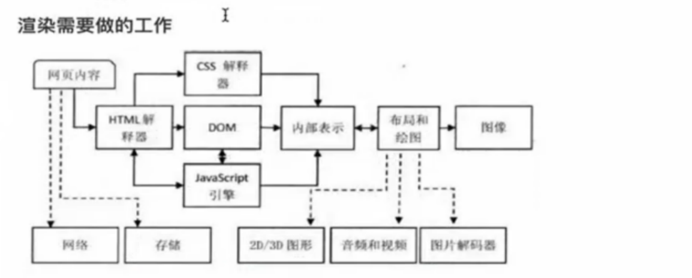

> 富贵五更春梦，功名一片浮云。眼前骨肉亦非真，恩爱翻成仇恨。莫把金枷套颈，休将玉锁缠身。清心寡欲脱凡尘，快乐风光本分 --- 【定场诗】

# 浏览器

浏览器是用户访问互联网最重要的一个入口

`本质上，浏览器是方便一般互联网用户通过界面解析和发送http协议的软件`

## 了解一点浏览器的内核知识

对于浏览器来说，内核是其核心，浏览器的内核需要提供 API 给开发者使用，同时提供最核心的功能，如加载和渲染网页，调用操作系统提供的服务等...

对于浏览器产商来说，高效的使用和开发内核是核心问题，对于 web 开发者来说，理解浏览器的内核的基本机制，才能高效的开发 web 应用

浏览器的内核就是浏览器的渲染引擎，早期的渲染引擎是一个统一的整体，后来随着 js 的权重的不断提高，js 引擎可以理解为慢慢独立出来。

现在我们理解的浏览器的内核 = 浏览器渲染引擎 + 浏览器 JS 引擎

市场上现在的主流内核：

- Chrome 浏览器：Blink + JS 引擎：V8
- Firefox 浏览器：Gecko + JS 引擎：SpiderMonkey
- Safari 浏览器：Webkit + JS 引擎：JavaScriptCore
- IE 浏览器: Trident 内核
- Edge 浏览器：EdgeHTML

浏览器渲染需要的工作流程：


上图表示了浏览器的一般渲染过程，虚线部分是该阶段所依赖的外部模块（不属于渲染引擎）

主要组件：

- HTML 解释器：解释 HTML 文本，将文本 -》 DOM 树
- CSS 解释器：遇到样式，为 DOM 对象计算出样式信息
- JS 引擎：解析 JS 代码，有调用 DOM 接口和 CSSOM 接口的能力
- 布局：结合 CSS 计算出每个 DOM 对象的大小位置信息
- 绘图：将经过布局计算的 DOM 节点绘制成对象

以上这些构成了一个完整的浏览器内核
eg: webkit 的内核架构图：


## 了解浏览器的渲染原理

上面提到的渲染引擎用来将网页代码渲染为用户视觉可以感知的平面文档

不同的渲染引擎在一些流程和细节处理上是有区别的但是大体上都是分成下面的四个阶段：

- 解析代码：HTML 代码解析为 DOM，CSS 代码解析为 CSSOM（CSS Object Model）
- 对象合成：将 DOM 和 CSSOM 合成一棵渲染树（render tree）
- 布局：计算出渲染树的布局（layout）
- 绘制：将渲染树绘制到屏幕

以上四步并非严格按顺序执行，往往第一步还没完成，第二步和第三步就已经开始了。所以，会看到这种情况：网页的 HTML 代码还没下载完，但浏览器已经显示出内容了。

### 输入 URL 发生了什么之浏览器篇

先了解一些基本的概念

- 下载（加载） 浏览器将资源下载到本地的过程
- 解析 将一个元素通过一定的方式转换成另一种形式
- DOM 构建 将文档中的所有 DOM 元素构建成一个树型结构，DOM 构建是自上而下进行构建的，会受到 js 的干扰
- CSS 构建 将文档中的所有 CSS 资源合并。
- Render 树 将 DOM 树和 CSS 合并成一棵渲染树，render 树在合适的时机会被渲染到页面中

当我们访问一个页面时，服务端会先返回一个带有一堆 html 字符串的响应信息，接下来就是浏览器渲染的一个完整的流程

- HTML 文档的加载与页面的首次渲染
  - 浏览器首先下载该地址所对应的 html 页面
  - 浏览器解析 html 页面的 DOM 结构
  - 开启下载线程(新开的线程)对文档中的所有资源按优先级排序下载，同时主线程会对文档进行解析
    - 遇到 script 标签时，首先阻塞后续内容的解析，同时检查该 script 是否已经下载下来，如果已下载，便执行代码
    - 遇到 link 标签时，不会阻塞后续内容的解析（比如 DOM 构建），检查 link 资源是否已下载，如果已下载，则构建 cssom
    - 遇到 DOM 标签时，执行 DOM 构建，将该 DOM 元素添加到文档树中。
  - 将 DOM 树和 CSS 合并成一棵渲染树(Render Tree)
    - 渲染树只会包括需要显示的节点和这些节点的样式信息，如果某个节点是 display: none 的，那么就不会在渲染树中显示
      
  - 计算每个 Frame(Element - 元素) 的位置，宽高等属性
    - 这一阶段浏览器要做的事情是要弄清楚各个节点在页面中的确切位置和大小。通常这一行为也被称为“自动重排”
    - 布局流程的输出是一个“盒模型”，它会精确地捕获每个元素在视口内的确切位置和尺寸，所有相对测量值都将转换为屏幕上的绝对像素。
  - 绘制
    - 布局完成后，浏览器会立即发出“Paint Setup”和“Paint”事件，将渲染树转换成屏幕上的像素

TIPS：在 body 中第一个 script 资源下载完成之前，浏览器会进行首次渲染【First-Contentful-Paint】，将该 script 标签前面的 DOM 树和 CSSOM 合并成一棵 Render 树，渲染到页面中。这是页面`从白屏到首次渲染的时间节点`

```html
<body>
  <!-- 白屏 -->
  <div id="div1"></div>
  <!-- 白屏 -->
  <link rel="stylesheet" href="./c1.css" />
  <!-- 白屏 -->
  <link rel="stylesheet" href="./c3.css" />
  <!-- 如果此时 j1.js 尚未下载到本地，则首次渲染，此时的 DOM 树 只有 div1 ，所以页面上只会显示 div1，样式是 c1.css 和 c3.css 的并集。-->
  <!-- 如果此时 j1.js 已经下载到本地，则先执行 j1.js，页面不会渲染，所以此时仍然是白屏。-->
  <!--下面的 js 阻塞了 DOM 树的构建，所以下面的 div2 没有在文档的 DOM 树中。 -->
  <script src="http://test.com:9000/mine/load/case2/j1.js
  "></script>
  <!-- j1.js 执行完毕，继续 DOM 解析，div2 被构建在文档 DOM 树中，此时页面上有了div2 元素，样式仍然是 c1.css 和 c3.css 的并集 -->
  <link rel="stylesheet" href="./c4.css" />
  <!-- c4.css 加载完毕，重新构建render树，样式变成了 c1.css、c3.css 和 c4.css 的并集 -->
  <div id="div2"></div>
</body>
```

问题：
为什么 js 会阻塞主线程的解析？
简单的可以说 js 可以操作 dom，也可以修改样式，为了避免冲突，所以一旦有 JS 文件，它会阻塞 DOM 的构建，它也会导致 CSSOM 也阻塞 DOM 的构建。【在没有 js 的情况下，CSSOM 是不允许 DOM 的】


## Chrome V8 垃圾回收机制 （分代式垃圾回收机制）

V8 的垃圾回收策略基于分代回收机制，该机制有两个假说为依据：

- 大部分新生对象倾向于早死
- 不死的对象，会活得更久

### V8 的内存分代

在 V8 中，将内存分为了新生代（new space）和老生代（old space）。它们特点如下

- 新生代：对象的存活时间较短。新生对象或只经过一次垃圾回收的对象
- 老生代：对象存活时间较长。经历过一次或多次垃圾回收的对象

V8 堆的空间等于新生代空间加上老生代空间。我们可以通过`--max-old-space-size`命令设置老生代空间的最大值，`--max-new-space-size` 命令设置新生代空间的最大值

默认设置下，新老生代的内存如下：

| 类型\系统位数           | 64 位  | 32 位 |
| ----------------------- | ------ | ----- |
| 老生代                  | 1400MB | 700M  |
| reserved_semispace_size | 16M    | 8M    |
| 新生代                  | 32M    | 16M   |

(新生代，它由两个 reserved_semispace_size 组成 )

#### Stop The World （全停顿）
  垃圾回收算法在执行前，需要将应用逻辑暂停，执行完垃圾回收后再执行应用逻辑，这种行为称为 「全停顿」（Stop The World）。例如，如果一次 GC 需要 50ms，应用逻辑就会暂停 50ms

#### 新生代

新生代中的对象主要通过 Scavenge 算法进行垃圾回收。Scavenge 的具体实现，主要采用了 Cheney 算法。

Cheney 算法将内存一分为二, 每个空间称为 semispace，一个处于使用中（Form），一个处于闲置中(To)

流程如下：

- 从 From 空间分配对象，若 semispace 被分配满，则执行 Scavenge 算法进行垃圾回收
- 检查 From 空间的存活对象，若对象存活，则检查对象是否符合晋升条件，若符合条件则晋升到老生代，否则将对象从 From 空间复制到 To 空间
- 若对象不存活，则释放不存活对象的空间
- 完成复制后，将 From 空间与 To 空间进行角色翻转（flip）【即form变to, to变form】

对象晋升条件

- 对象是否经历过 Scavenge 回收。对象从 From 空间复制 To 空间时，会检查对象的内存地址来判断对象是否已经经过一次 Scavenge 回收。若经历过，则将对象从 From 空间复制到老生代中；若没有经历，则复制到 To 空间

- To 空间的内存使用占比是否超过限制。当对象从 From 空间复制到 To 空间时，若 To 空间使用超过 25%，则对象直接晋升到老生代中。设置为 25%的比例的原因是，当完成 Scavenge 回收后，To 空间将翻转成 From 空间，继续进行对象内存的分配。若占比过大，将影响后续内存分配。

新生代算法的优缺点：
它的缺点是只能使 用堆内存的一半，这是一个典型的空间换时间的办法， 但是新生代声明周期较短，恰恰就适合这个算法

#### 老生代

老生代中的对象有两个特点，第一是存活对象多，第二个存活时间长。若在老生代中使用 Scavenge 算法进行垃圾回收，将会导致复制存活对象的效率不高，且还会浪费一半的空间。因而，V8在老生代采用Mark-Sweep 和 Mark-Compact 算法进行垃圾回收

- Mark-Sweep【标记清除的意思。它主要分为标记和清除两个阶段】
    - 标记阶段，它将遍历堆中所有对象，并对存活的对象进行标记
    - 清除阶段，对未标记对象的空间进行回收
    - 问题：但是清除过 后出现内存不连续的情况，这样会对后续大对象的内存分配造成问题，没有任何一个碎片内支持分配，这将提前触发一次垃圾回收

- Mark-Compact 【标记整理 算法】
它是基于 Mark-Sweep 演变而来的，标记阶段和额Mark-Seep逻辑一致，但在清除阶段它先将活着的对象移到一边，移动完成后，直接清理边界外的内存。

TIPS：由于Mark-Compact需要移动对象，所以执行速度上，比Mark-Sweep要慢。所以，V8主要使用Mark-Sweep算法，然后在当空间内存分配不足时，采用Mark-Compact算法。

#### Incremental Marking（增量标记）
在新生代中，由于存活对象少，垃圾回收效率高，全停顿时间短，造成的影响小。但是老生代中，存活对象多，垃圾回收时间长，全停顿造成的影响大。为了减少全停顿的时间，V8对标记进行了优化，将一次停顿进行的标记过程，分成了很多小步。每执行完一小步就让应用逻辑执行一会儿，这样交替多次后完成标记。从2011年起，v8就将「全暂停」标记换成了增量标记

#### lazy sweeping（延迟清理）
- 发生在增量标记之后
- 堆确切地知道有多少空间能被释放
- 延迟清理是被允许的，因此页面的清理可以根据需要进行清理
- 当延迟清理完成后，增量标记将重新开始
