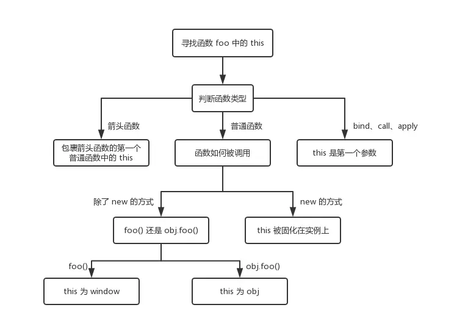

> 知之真切笃行处即是行, 行之明觉精查处即是知, 知行功夫本不可离 - 王阳明

# javascript 小结（2）

## this

执行上下文: 调用时产生的上下文环境

this 是 js 中当前执行代码的环境对象，如果简单的说可能就是 `this指向最后一个调用它的对象`，后面看 js 的执行堆栈可以了解到 this 的本质原理是`动态绑定`

this 的使用场景

```js
// 1 普通函数中使用
test();
function test() {
  console.log(this); // window 如果 在“严格模式”下，此处是 undefined
}

// 2 对象中的使用
var obj = {
  arg1: 1,
  fn: function () {
    console.log(this.arg1);
  },
};
obj.fn(); // 1

// 3 显性绑定
function test2() {
  console.log(this);
}
test2.bind(null)();
test2.apply(null, []);
test2.call(null);

// 4 作为构造函数中使用，this比较特殊，先赋值给空对象，最后return this
function User(name) {
  this.name = name;
}
var user = new User("123");
```

总结：

- 乍看一下（1）和（2）差不多，其实不然，（1）是对函数的直接调用，前面没有任何前缀
- 对于直接调用函数来说，不管函数被放在了什么地方，this 一定是 window 【非严格模式下】
- 对于对象中的使用，this 永远指向最后一个调用它的对象
- 对于构造函数中的使用，this 永远绑定到当前 new 出来的对象上，不会改变
- 箭头函数中的 this，只取决包裹箭头函数的第一个普通函数(对象)的 this，因为箭头函数没有自己的 this
- bind, apply, call 强制改变函数的 this，一个函数进行多次 bind，上下文由第一次的绑定决定



## 作用域 && 作用域链

### 作用域

ES6 中的三种作用域：全局作用域，函数作用域，块级作用域（需要用到`let`）

**作用域可以理解为变量存在的范围，注意和执行上下文, this 的区别**

- 作用域是`定义的时候确认下来的`
- 执行上下文是代码具体执行到那块逻辑的时候确认下来的

作用域的一些要注意的点：

- 作用域既有线性链式顺序关系【叫包含关系不准确】也有独立关系
  ```js
  // a = 10 是全局作用域中的定义，我们可以在test1, test3函数内部获取到  【线性】
  // test2中也定义了a值，会在作用域内覆盖同名变量，即test2中a=11
  // 函数内部声明的变量外部无法读取，其他同级函数无法获取 【独立】
  var a = 10;
  function test1() {
    console.log(a);
  }
  function test2() {
    var a = 11;
    console.log(a);
  }
  function test3() {
    var b = 12;
    console.log(a, b);
  }
  ```

### 自由变量

当前作用域中没有定义的变量，即 ‘自由变量’

如上面代码中的 test1 函数中的`a`, a 并没有在 test1 中声明，它取得是 test1 函数的`父级作用域`中声明的变量

函数的父级作用域是函数的定义时候的作用域，是静态的，而非执行时动态的（和 this 区分开来）

```js
var a = 10;
function test() {
  console.log(a);
}
function test2(fn) {
  var a = 20;
  fn();
}
test2(test);
```

### 作用域链

如果说作用域是一套规则，作用域链就是规则的具体实现，关于作用域链也留到后面 JS 的执行堆栈分析中去聊
但可以确认的是在当前作用域中自由变量会一级一级向父作用域去找，表面看起来就是一个链式结构

## 闭包

函数 A 中有函数 B(并不一定是要返回)，函数 B 中有用到函数 A 定义的变量，那么函数 B 就是一个闭包

闭包最大的特点，就是它可以“记住”诞生的环境

闭包的本质是`scoped`，在后面的 js 堆栈执行过程中也会说明

闭包最大用处有两个，一个是可以读取函数内部的变量，另一个就是让这些变量始终保持在内存中，在实际的开发中主要用于`封装变量（eg:私有属性，私有方法）, 收敛权限（eg:外部能访问，但不能修改）`

TIPS: 外层函数每次运行，都会生成一个新的闭包，而这个闭包又会保留外层函数的内部变量，所以内存消耗很大。因此不能滥用闭包

```js
function Person(name, age) {
  var name = name
  var _age = age;


  function getAge() {
    return _age;
  }

  return {
    name: name,
    getAge: getAge
  };
}

var p1 = Person('张三', 26);
p1.getAge()

// 还有循环中使用闭包解决 `var` 定义函数的问题
...
```

## 原型 && 原型链

要了解原型和原型链首先要明白（记住）几条规则，这些规则没有为什么是这样一说，因为 JS 就是这么设计的

- 所有的引用类型（对象，数组，函数）都具有对象的特征，可以自由的扩张属性
- 所有的引用类型（对象，数组，函数）都有一个 **proto**属性（`隐式原型`），属性值也是一个对象
- `绝大部分`函数都有 prototype 属性（`显示原型`）,属性值也是一个对象 【Function.prototype.函数 没有显示原型】
- 函数的 prototype 作为对象，也有**proto**属性，同时还有一个`constructor`属性，用于执行当前的构造函数（就是函数本身）
- 引用类型的 **proto** 属性指向原型（当前对象构造函数的 prototype 值）， **proto** 将对象和原型连接起来组成了原型链
- 当试图获取一个对象的属性时，如果对象没有该属性，就会去它的 **proto** 中寻找

TIPS:

- Object [构造函数] 是所有对象的爸爸，所有对象都可以通过 **proto** 找到它

- Function [构造函数] 是所有函数的爸爸，所有函数都可以通过 **proto** 找到它

- 函数的 constructor 直接指向 Function

```js
((({}.__proto__.constructor === Object({}).__proto__.__proto__) ===
  null(console.log).__proto__.constructor) ===
  Function);

function test() {}
test.prototype.constructor === test; // true
test.prototype.__proto__.constructor === Object; // true

// 最底层
Object.__proto__ === Function.prototype; // true
Object.prototype.__proto__ === null; // true

Function.__proto__.__proto__.constructor === Object;
Function.prototype.__proto__.constructor === Object;
Function.__proto__.constructor === Function

// 设计构造函数
Object.constructor === Function;
Function.constructor === Function;

// 分析
Function instanceof Object;
// Function.__proto__ = obj1 => { constructor: Function, __proto__ }
// obj1.__proto__ = obj2 [Object.prototype] => { constructor: Object, __proto__: null  }

Object instanceof Function;
// Object.__proto__ = obj1 [Function.prototype] => { constructor: Function, __proto__ }
```

## 深浅拷贝

- 浅拷贝

  如果存在一个复杂的对象，它的属性存在也是对象的情况，这个时候拷贝它的第一层值（属性是对象就就只拷贝地址）

  拷贝后对象中复杂属性的字段修改还是会影响到之前的对象

  方法：`Object.assign`, `{...a}`

- 深拷贝

  多层嵌套仍然每次完整的拷贝具体的值，新拷贝的对象和老对象完全分离

  通过 `JSON.parse(JSON.stringify(object))` 来解决, 也有局限性

  - 会忽略 undefinedv
  - 会忽略 symbol
  - 不能序列化函数
  - 不能解决循环引用的对象

  ```js
  let a = {
    age: undefined,
    sex: Symbol("male"),
    jobs: function () {},
    name: "yck",
  };
  let b = JSON.parse(JSON.stringify(a));
  console.log(b); // {name: "yck"}
  ```

  比较完美的解决方法是使用 `lodash cloneDeep`, 其实自己完美的实现一个深拷贝是很困难的，需要我们考虑好多种边界情况，比如原型链如何处理、DOM 如何处理等等

  