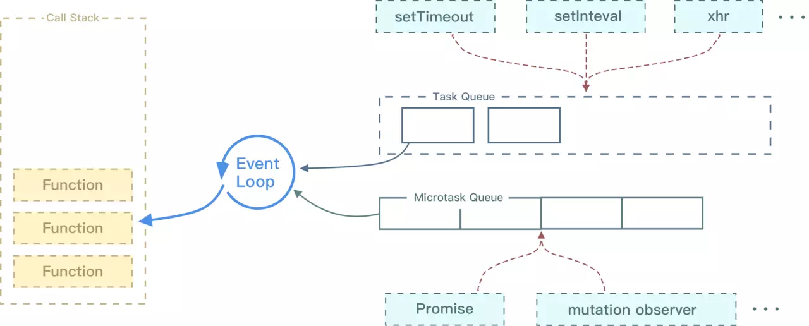

> 铺眉苫眼早三公，裸袖揎拳享万钟。胡言乱语成时用，大纲来都是哄。说英雄谁是英雄？五眼鸡岐山鸣凤。两头蛇南阳卧龙，三脚猫渭水飞熊 - 张鸣善 《水仙子》

# JS 总结

## JS 的语言特性

js 是一门**主线程**为单线程的语言，同时它要也是一门解释型语言。这是由 Javascript 这门脚本语言的用途决定的

Web Worker 并没有改变 JavaScript 单线程的本质。Worker 可以理解是浏览器给 JS 引擎开的外挂，专门用来解决那些大量计算问题

创建 Worker 时，JS 引擎向浏览器申请开一个子线程（子线程是浏览器开的，完全受主线程控制，而且不能操作 DOM）

js本身不可能是异步的，但js的宿主环境（比如浏览器，Node）是多线程的，宿主环境通过某种方式（事件驱动）使得js具备了异步的属性。所以浏览器和node的异步逻辑是存在区别的

## JS 执行堆栈

进一步了解 JS

虽然传统上我们说 js 是从上到下，边解释边执行。但实际上更准确的说它是及时编译的，即 js 也是有预编译和执行两个过程的。

- 代码预编译阶段
- 代码执行阶段

**预编译阶段是前置阶段，这个时候由编译器将 JavaScript 代码编译成可执行的代码**。 注意，这里的预编译和传统的编译并不一样，传统的编译非常复杂，涉及分词、解析、代码生成等过程 。这里的预编译是 JavaScript 中独特的概念，虽然 JavaScript 是解释型语言，编译一行，执行一行。但是在代码执行前，JavaScript 引擎确实会做一些“预先准备工作”。

在通过语法分析，确认语法无误之后，JavaScript 代码在预编译阶段对变量的内存空间进行分配，我们熟悉的变量提升过程便是在此阶段完成的，经过预编译过程，我们应该注意三点：

- 预编译阶段进行变量声明
- 预编译阶段变量声明进行提升，但是值为 undefined
- 预编译阶段所有非表达式的函数声明进行提升

**执行阶段主要任务是执行代码，执行上下文在这个阶段全部创建完成。**

`执行上下文分`也为两大阶段。

- 创建阶段（函数被调用，但是还未执行函数中的代码）

  - 创建变量，参数，函数，arguments 对象
  - 建立作用域链
  - 确定 this

- 执行阶段：变量赋值，函数引用，执行代码
  - 将预编译阶段创建的当前执行上下文的 VO -》AO，并将确认的内容赋值

> TIPS：作用域在预编译阶段确定，但是作用域链是在执行上下文的创建阶段完全生成的。因为函数在调用时，才会开始创建对应的执行上下文。执行上下文包括了：`变量对象、作用域链以及 this 的指向`

代码执行的整个过程说起来就像`一条生产流水线`

- 第一道工序是在预编译阶段创建变量对象（Variable Object），此时只是创建，而未赋值
- 下一道工序代码执行阶段，变量对象转为激活对象（Active Object），即完成 VO → AO。此时，作用域链也将被确定，它由当前执行环境的变量对象和所有外层已经完成的激活对象组成

几个关键字的解释：

- 执行上下文（Execute Contenxt）

执行上下文是评估和执行 JavaScript 代码的环境的抽象概念。每当 Javascript 代码在运行的时候，它都是在执行上下文中运行

- 全局执行上下文
- 函数执行上下文
- Eval 函数执行上下文

- 执⾏栈（Execution Context Stack）

`执行栈`有别与存储值类型的数据的栈（Stack）。执行栈，也就是在其它编程语言中所说的“调用栈”，是一种拥有 LIFO（后进先出）数据结构的栈，被用来存储所有执行上下文。

浏览器解释器执⾏ js 是单线程的过程，这就意味着同⼀时间，只能有⼀个事情在进⾏。其他的活动和事件只能排队等候，⽣成出⼀个等候队列执⾏栈（Execution Stack）

- 变量对象（Variable Object）

创建执行上下文时与之关联的会有一个变量对象，该上下文中的所有变量和函数全都保存在这个对象中。

- 活动对象（Activation Object）

进入到一个执行上下文时，此执行上下文中的变量和函数都可以被访问到，可以理解为被激活

---

JS 运行的完整流程
js 在执⾏可执⾏的脚本时，⾸先会创建⼀个全局可执⾏上下⽂ globalContext，每当执⾏到⼀个函数调⽤时都会创建⼀个可执⾏上下⽂（execution context）EC。当然可执⾏程序可能会存在很多函数调⽤，那么就会创建很多 EC，所以 JavaScript 引擎创建了执⾏上下⽂栈（Execution context stack，ECS）来管理执⾏上下⽂。当函数调⽤完成，js 会退出这个执⾏环境并把这个执⾏环境销毁，回到上⼀个⽅法的执⾏环境... 这个过程反复进⾏，直到执⾏栈中的代码全部执⾏完毕，

```js
var a = 10;
test(22);

function test(i) {
    var a = 'hello';
    var b = function privateB() {

    };
    function c() {
      console.log('hello world')
    }
    c();
}

// 1 全局预编译阶段，变量提升，生成Global Execute Context，同时生成对应的全局VO
GlobalExectionContext = {
  scopeChain: { ... }
  this: {...}
  VO(globalContext) {
    a: 10,
    test: <reference to function>
  }
}

ECStack = [
  globalContext
]

// 2 全局执行阶段，自上而下执行到test处，test是一个即将执行的函数，局部预编译test，创建test函数上下文
// 2.1 函数上下文创建阶段
testExecutionContext = {
  scopeChain: { ... }
  this: {...}
  VO(test functionContext) = {
    arguments: {
      0: 22,
      length: 1
    },
    i: 22,
    a: undefined,
    b: undefined,
    c: pointer to function c()
  };
}

ECStack = [
  testExecutionContext,
  globalContext
]

// 2.2 函数上下文执行阶段, Vo激活编程AO
testExecutionContext = {
    scopeChain: { ... },
    this: { ... },
    variableObject[AO]: {
        arguments: {
            0: 22,
            length: 1
        },
        i: 22,
        c: pointer to function c()
        a: 'hello',
        b: pointer to function privateB()
    }
}

// 执行test内部的代码逻辑，执行完毕后，出栈
ECStack = [
  testExecutionContext, ↲↲ // 出栈，删除 
  globalContext
]
```

> 总结：闭包的原理是Scope，this的原理是动态绑定，作⽤域链的原理是 Scope: [AO, globalContext.VO], eval不能回收的原理是推不进AO,变量提升的原理是AO的准备阶段，异步队列的原理是ECStack.

## 浏览器的事件环（Event Loop）

`要与后面Node的Event Loop 区分开`

JS 作为语言，它的运行是依赖宿主环境的，Event Loop 不是 js 的功能或者特性，而是宿主环境的一套事件驱动的运行机制，所以在浏览器和 node 两个不同的宿主环境上，JS 的同步、异步的执行顺序和逻辑是有所区别的。

JS 的代码自上向下顺序执行，当遇到异步代码的时候，会被挂起并在需要执行的时候加入到 Task（有多种 Task） 队列中。一但主线程执行栈中的所有同步任务执行完成（执行栈为空），Event Loop 就会从 Task 队列中拿出需要执行的代码并放入执行栈中执行，所以本质上来说 JS 中的异步还是同步行为

不同的任务源会被分配到不同的 Task 队列中，任务源可以分为 `微任务（microtask） 和 宏任务（macrotask）`。

微任务包括 `process.nextTick ，promise ，MutationObserver`
宏任务包括 `script, setTimeout ，setInterval ，setImmediate ，I/O ，UI rendering`



分析一个复杂的例子
```js
console.log('script start')

async function async1() {
  await async2()
  console.log('async1 end')
}
async function async2() {
  console.log('async2 end')
}
async1()

setTimeout(function() {
  console.log('setTimeout')
}, 0)

new Promise(resolve => {
  console.log('Promise')
  resolve()
})
  .then(function() {
    console.log('promise1')
  })
  .then(function() {
    console.log('promise2')
  })

console.log('script end')

// 代码的执行顺序是：
// script start => async2 end => Promise => script end => promise1 => promise2 => async1 end => setTimeout
```

为何是这样的顺序？
- await后面相当于执行了一个 promise，promise的钩子函数会立即执行，执行完await相当于 then 了一下获取promise resolve的值，所以await后面的函数立即执行，但执行完就会让出当前线程
- 当同步代码全部执行完毕以后，就会去执行所有的异步代码，回到await,执行返回的 Promise 的 resolve 函数，这又会把 resolve 丢到微任务队列中
- 接下来执行 then中的回调，当两个 then 中的回调全部执行完毕以后，又会回到 await 的位置处理返回值

上面async,await部分的代码可以改造成下面这样
```js
new Promise((resolve, reject) => {
  console.log('async2 end')
  // Promise.resolve() 将代码插入微任务队列尾部
  // resolve 再次插入微任务队列尾部
  resolve(Promise.resolve())
}).then(() => {
  console.log('async1 end')
})
```

> TIPS: 注意：新的浏览器中不是如上打印的，因为 新浏览器做了优化，没有完全遵守规范，await 变快了，具体内容可以往下看

async1 end 需要等待三个 tick 才能执行到，V8团队在引擎底层将三次 tick 减少到了二次 tick。

Event Loop 执行顺序如下所示
- 首先执行同步代码，这属于宏任务
- 当执行完所有同步代码后，执行栈为空，查询是否有异步代码需要执行
- 执行所有微任务
- 当执行完所有微任务后，如有必要会渲染页面
- 执行宏任务中的异步代码，也就是 setTimeout 中的回调函数（可能会有多个宏任务异步代码）
  - 执行完一个异步代码，再去确认是否有微任务执行
  - 执行完所有微任务，再回来执行下一个宏任务的异步代码，直到最后

**宏任务中包括了 script ，浏览器会先执行一个宏任务，接下来有异步代码的话才会先执行微任务**
**每执行一个宏任务的异步都会回到微任务，清空微任务再执行下一个宏任务异步**

