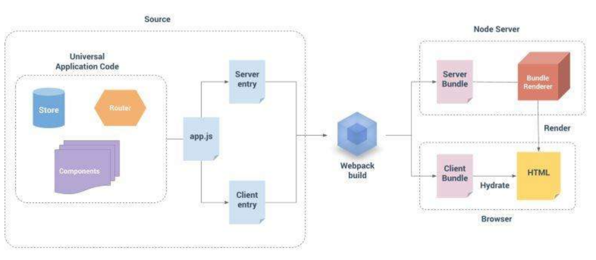

优化SEO的方法： （一下内容都是基于vue来实现的）

# 预渲染
**原理**
- 先在本地跑一个无头浏览器 - 提前将内容渲染出来，获取渲染后的完整的dom元素存储到html里面去，爬虫的原理 
- 不实时，只适用于纯静态的页面，如果是有请求数据的动态页面，它获取到数据后存起来，build后访问的就是上次构建的存储过的静态页面的数据。
Vue预渲染的基本使用：
```
npm install prerender-spa-plugin 

// -- vue.config.js
const PrerenderSPAPlugin = require('prerender-spa-plugin');
const path = require('path');
// 会默认下载一个开发版的chrome
module.export = {
    configureWebpack: {
        plugins: [
            new PrerenderSPAPlugin({
                staticDir: path.join(__dirname, 'dist'),
                // 将 路由为 “ / 和 about ”的内容构建为完整的html静态页面
                routes: [ '/', '/about',],
            })
        ]
    }
}

// 运行npm run build 构建静态页面
```


# SSR
放在服务器进行就是服务器渲染，放在浏览器进行就是浏览器渲染  
- 客户端渲染不利于 SEO 搜索引擎优化
- 服务端渲染是可以被爬虫抓取到的，客户端异步渲染是很难被爬虫抓取到的
- SSR直接将HTML字符串传递给浏览器。大大加快了首屏加载时间。
- SSR占用更多的CPU和内存资源
- 一些常用的浏览器API可能无法正常使用
- 在vue中只支持beforeCreate和created两个生命周期


## SSR基本实现
通过vue-server-renderer 配合 express看看vue ssr的基本实现情况

...
...

实现没有问题，但实际的开发中是通过这种方式在server中写vue模板渲染的代码是不方便的，真正实际的开发需要配合webpack去做

## webpack ssr

