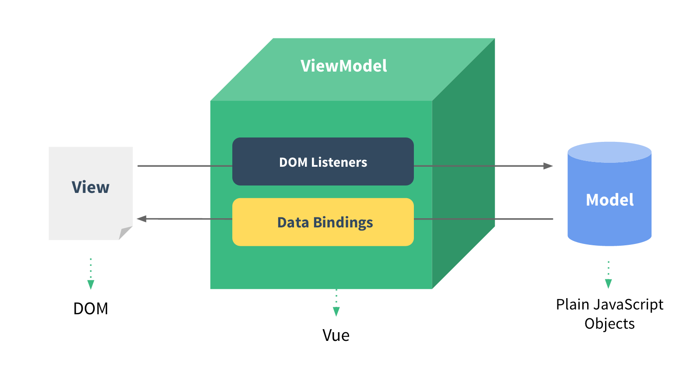

> 言尽于此，愿君之勿忘也 ······ 临颖神驰，书不成字，纸短情长，伏惟珍重 - 徐枕亚《玉梨魂》

后面相当长的一段时间，我会学习vuejs的相关内容。
说来惭愧，vuejs应该是绝大部分前端都会的框架，但我的学习路径确是从angular (不是angularjs)开始的。
虽然angular在我看来，除了比较“重”以外，没有什么明显的缺点。但vuejs的大热还是倒推着我去学习它。抛开语法不说，它们的核心思想和理念有很多异曲同工的地方。有一定基础的上手起来应该会稍微轻松点吧。

Vue (读音 /vjuː/，类似于 view) 是一套用于构建用户界面的渐进式框架
> 比较自豪的一点是它的创作者是一位中国人，我想这个因素也是为它这么火加了不少分吧

### 这里先确认两个概念，
* 什么是库？什么是框架？
    * 库（jquery）将代码集合成一个产品，我们来调用库中的方法来实现自己的功能（我们是主导方）
    * 框架（react, angular, vue）为解决一类问题而开发出来的产品，我们遵循框架的规则和语法，在指定的位置填写对应的代码。框架来帮我们调用（框架是主导方）
* mv-c 和 mv-vm (这里的mvc是前端的mvc和 java后端语言的mvc有细微的区别)
    * m - model (模型层), v - view(视图层)，c - controller(控制层)， vm - viewmodel(视图模型层)
    * mvc如下：
        
    * mvvm 如下
        
    * 区别：在传统的mvc中除了model和view以外的逻辑都放在了controller中，导致controller逻辑复杂难以维护,在mvvm中view和model没有直接的关系，全部通过viewModel进行交互

开始安装&运行 vue（先不使用vue-cli）
```html
- yarn init -y
- yarn add vue

<!-- 1-start.html -->
<!DOCTYPE html>
<html lang="en">
<head>
    <meta charset="UTF-8">
    <meta name="viewport" content="width=device-width, initial-scale=1.0">
    <meta http-equiv="X-UA-Compatible" content="ie=edge">
    <!-- 导入vue.js -->
    <script src="node_modules/vue/dist/vue.js"></script>
    <title>Document</title>
</head>
<body>
    <div id="app">
        hello world
        {{ arr }}
        {{ obj }}
    </div>

    <script>
        // new 一个vue对象出来，传入的参数：el, data
        let vm = new Vue({
            el: '#app',
            data: {
                arr: [1,2,3],
                obj: {
                    name: 'z3'
                }
            }
        });
        vm.arr1 = [1,2,3,4,5];
        vm.obj.name = 'l4';
        vm.obj.age = '14';
    </script>
</body>
</html>
```

### vue的思维导图
* vue hello world
* vue 表达式使用 
    * 取值
    * 计算
    * 三元
    * js

tip: 
* 取值的问题：什么情况下修改值，值不会发生变化
* 常见的属性和方法
* 属性：$el, $data
* 方法：$set(), $mount(), $nextTick(), $watch();

#### 指令：
```
v-once
v-if <--> v-else-if <--> v-else
v-html
v-for(key的作用)
v-text
v-bind:
v-on:
```

vue 内的属性 data, methods, el, computed (存取器 getter, setter), watch(监听器)

```
computed: {
   test() {
       return ''
   } ,
   test2: {
       get: function() {
           
       }
   }
}
```

v-bind - 数据 - v-bind:test = "test" - :test="tst"

v-on - 事件 - v-on:click="test()" - @click="test($event)"
修饰符：prevent, stop, self, once, capture...

表单元素双向绑定： v-model="test" - 实现原理：v-bind  v-on
修饰符：trim., number lazy

生命周期：
* beforeCreate - 初始化，还未创建 data和el都是undefined, 数据监控还未配置
* created - 创建成果，数据有了，观测 配置和方法 watch事件回调 - ajax数据操作
* beforeMount - 挂载之前，相关的render函数被调用，dom出现但数据没有渲染上去。
* mounted - 数据已经渲染。 dom操作
* beforeUpdate - 更新之前 ，虚拟dom重新渲染之前
* updated - 渲染后，不要在此处添加变量变化的逻辑
* beforeDestory - 销毁之前，实例任然可以使用，可以执行优化操作
* destoryed - 销毁后

组件交互：
属性输入：校验 validator - validator - 当 prop 验证失败的时候，(开发环境构建版本的) Vue 将会产生一个控制台的警告。


### 初步了解vue数据监听的机制


