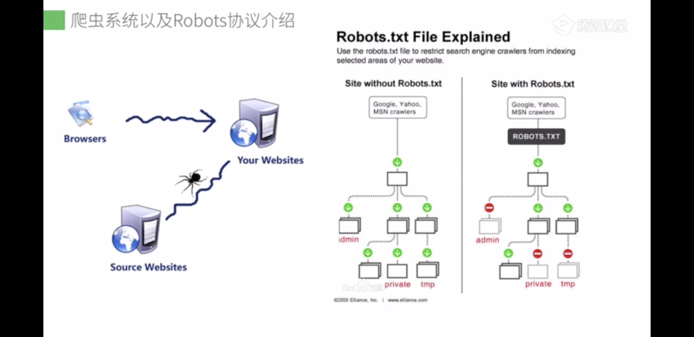

# 爬虫

## Node 爬虫
自动获取网页内容，是搜索引擎的重要组成部分，搜索引擎的优化相当大一部分是对爬虫的优化

robots.txt是一个文本文件，它是一个协议，不是一个命令，它是爬虫要查看的第一个文件，它告诉爬虫在服务器上什么文件是可以被查看的。搜索机器人就会按照该文件中的内容来确定访问的范围。

爬虫抓取的是html内容，对于传统的爬虫而言是无法获取ajax（异步）请求的渲染后的内容的，在还没放回结构渲染时，爬虫已经获取好html文本了，google据说已经搞定这块了。 这就是为啥SPA的web站点的一个大缺点。



### 爬取内容几种方式

- 爬取 API 接口 （可以使用 axios）

```js
let axios = require("axios");
axios
  .get(
    "https://follow-api-ms.juejin.im/v1/getUserFollowInfo?uid=551d6923e4b0cd5b623f54da&src=web"
  )
  .then((res) => console.log(res.data));
```

- 爬取 HTML 页面 (superagent/request/crawl)

```js
let request = require("request");
request("https://juejin.im/tag/%E5%89%8D%E7%AB%AF", (err, response, body) => {
  let regexp = /class="title" data-v-\w+>(.+?)<\/a>/g;
  let titles = [];
  body.replace(regexp, (matched, title) => {
    titles.push(title);
  });
  console.log(titles);
});
```

- 使用 puppeteer 控制 chromium
  - puppeteer 是 Chrome 团队开发的一个 node 库
  - 可以通过 api 来控制浏览器的行为，比如点击，跳转，刷新，在控制台执行 js 脚本等等
  - 这个工具可以用来写爬虫，自动签到，网页截图，生成 pdf，自动化测试
  - api: https://github.com/GoogleChrome/puppeteer/blob/v1.7.0/docs/api.md

```js
(async () => {
  const browser = await puppeteer.launch(); //打开浏览器
  const page = await browser.newPage(); //打开一个空白页
  await page.goto("https://www.baidu.com"); //在地址栏输入网址并等待加载
  await page.screenshot({ path: "baidu.png" }); //截个图
  await browser.close(); //关掉浏览器
})();
```

```js
const puppeteer = require("puppeteer");
const fs = require("fs");
(async function () {
  const browser = await puppeteer.launch({ headless: false });
  const page = await browser.newPage();
  await page.goto("https://juejin.im/tag/%E5%89%8D%E7%AB%AF", {
    waitUntil: "networkidle2", // 等到newwork不请求新资源，即页面完全加载完成
  });
  await page.waitFor(500);
  // 获取指定节点的属性，querySelectAll
  let comments = await page.$$eval("a.title", (els) => {
    return els.map((item) => item.innerText);
  });
  console.log(comments);
  fs.writeFileSync("comments.txt", comments.join("\r\n"), "utf8");
  await browser.close();
})();
```


### 数据持久化
- 根据爬取的规则和策略，把爬取到的数据储到数据库中
- 如果要兼容不同的来源，需要对数据需要格式化
- 为不同的数据建立索引方便检索


## 实战
- 爬取博客数据，并存储到MySQL数据库中
- 以及定时任务爬虫来更新内容
- 对编码进行转换

使用到的一些库&node知识

- superagent 爬取html页面
- cheerio 可以理解为一个Node.js版本的jquery，使用方式和jquery基本相同
- debug 有时候需要输出一些调试信息，以便排查问题
- cron 用来周期性的执行某种任务或等待处理某些事件的一个守护进程
- 监听未知错误（异步的IO操作发生的错误无法被try catch捕获）
- 编码(iconv-lite) 
- nodemailer 一个简单易用的Node.js邮件发送模块
- pm2 进程管理器，通过pm2 start来启动程序